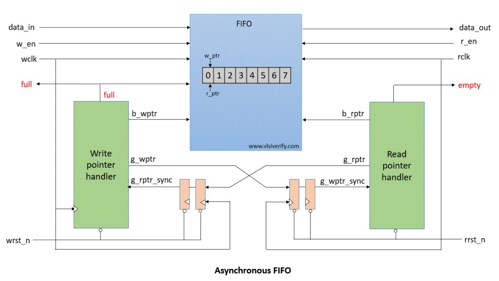

# Asynchronous FIFO in VHDL

## Overview
This project implements an **Asynchronous FIFO (First-In First-Out)** memory in VHDL. The design supports separate clock domains for read and write operations and uses Gray code pointers with double synchronization to ensure reliable operation across asynchronous boundaries.

This is a typical structure used in digital systems to buffer data between two subsystems running on different clocks, such as between an ADC and a processor or between different communication interfaces.

---

## Features

- **8-bit wide data**
- **8-entry depth** (configurable via `addr_width`)
- Separate read and write clocks (`rd_clk` and `wr_clk`)
- Full and Empty status flags
- Double-flop pointer synchronization to avoid metastability
- Binary-to-Gray and Gray-to-Binary conversion for safe clock-domain crossing
- Synthesizable and testbench included

---

## 📁 File Structure

| File                        | Description                                      |
|---------------------------- |--------------------------------------------------|
| `asynchronous_fifo.vhd`     | Main FIFO RTL design                             |
| `asynchronous_fifo_tb.vhd`  | Testbench to simulate and validate FIFO behavior |
| `README.md`                 | This documentation                               |

---

## How It Works

### FIFO Pointers

- **Write pointer (`wr_ptr_bin`)** and **read pointer (`rd_ptr_bin`)** are incremented in their respective clock domains.
- These are converted to **Gray code** before being passed across domains.
- Each domain synchronizes the opposite pointer with two flip-flops:
  - `wr_ptr_gray_sync1`, `wr_ptr_gray_sync2` for read domain
  - `rd_ptr_gray_sync1`, `rd_ptr_gray_sync2` for write domain

### Full/Empty Detection

- `full`: When the next `wr_ptr_gray` equals the inverted MSBs and same LSBs of synchronized `rd_ptr_gray`.
- `empty`: When `rd_ptr_gray` equals the synchronized `wr_ptr_gray`.

### Memory Access

- Write occurs on `wr_clk` when `wr_en` is high and `full` is low
- Read occurs on `rd_clk` when `rd_en` is high and `empty` is low

---

## Simulation

### Clocks

- `wr_clk` period: 20 ns
- `rd_clk` period: 10 ns

### Behavior

- Asserts reset at start
- Writes 8 values (`10` to `17`) into FIFO
- Waits for pointer synchronization
- Reads 8 values back
- Observe `data_out`, `full`, and `empty` during simulation

## How to Simulate
Use Xilinx ISE, ModelSim, or Vivado:
1. Compile both `.vhd` files
2. Run simulation
3. Verify waveform

## Usage

### Simulation
- Open ModelSim or your preferred simulator.

- Compile the source and testbench files.

- Run the provided TCL script (scripts/run_sim.tcl) to simulate.

- Observe the waveform to verify Asychronous FIFO Behavior.

### Synthesis & Implementation
- Open Quartus Prime.

- Create a new project targeting the DE10-Lite FPGA device.

- Add the source files from src/.

- Assign pins and add constraints as necessary.

- Compile and upload the bitstream to your FPGA.

## 🛠 Tools Used

- Quartus Prime software

- ModelSim for simulation

- DE10-Lite FPGA development board (optional for hardware testing)

- GitHub for version control and open-source documentation

---

🙋‍♀️ Author Developed by Sanjida Orin Tawhid

_MSc in Electronic Systems Design, specialization in Digital Design_  

